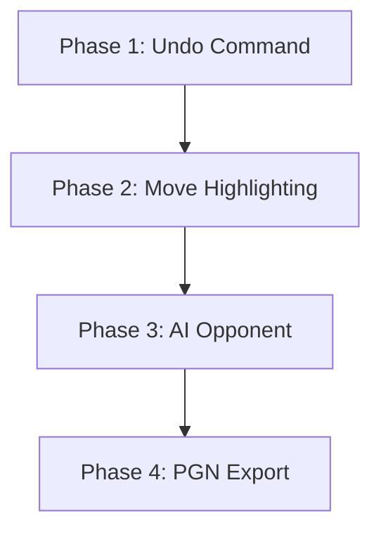

# Chess CLI Feature Roadmap

This roadmap outlines the recommended progression for implementing the proposed features. The phases are structured to minimize code conflicts, leverage existing data structures first, and systematically build up complexity.

---

## 📅 Implementation Phases

### 🛠️ Phase 1: Core Quality of Life (Undo Move)
* **Goal**: Enable players to take back mistakes.
* **Why first**: It relies entirely on existing data models and requires no new dependencies or visual renders.
* **Tasks**:
  - [ ] Add `piece_had_moved` tracking to `Move`.
  - [ ] Write `undo_move()` in `game.py`.
  - [ ] Add `undo` command parsing in `cli.py`.
* **Milestone**: Players can type `u` or `undo` to roll back any move (including castling, captures, promotions, and en passant).

### 👁️ Phase 2: Board Usability (Move Highlighting)
* **Goal**: Help players find valid moves visually.
* **Why second**: Enhances the command line interface without changing core game rules.
* **Tasks**:
  - [ ] Update `Board.display()` to accept `highlight_squares`.
  - [ ] Add `moves <square>` command mapping in `cli.py`.
  - [ ] Filter legal target squares and feed them to the renderer.
* **Milestone**: Typing `moves e2` redraws the board, showing destination targets marked with `*`.

### 🤖 Phase 3: Single Player Mode (AI Opponent)
* **Goal**: Allow play against the computer.
* **Why third**: Requires robust game logic and a fully functional move generation engine (Milestones 1 & 2 ensure moves are stable).
* **Tasks**:
  - [ ] Create `chess_cli/ai.py` with static evaluation values.
  - [ ] Implement Minimax with Alpha-Beta pruning.
  - [ ] Update `cli.py` to allow choosing CPU opponent at startup.
  - [ ] Auto-run CPU moves on CPU turns.
* **Milestone**: Players can start a game against a smart CPU opponent (White or Black).

### 💾 Phase 4: Portability (PGN Export)
* **Goal**: Export game logs for external analysis.
* **Why last**: Acts as a wrapper at the end of the game, recording all moves made by both humans and the CPU.
* **Tasks**:
  - [ ] Write `export_pgn()` to format standard PGN tags and move lists.
  - [ ] Prompt players to save their game on checkmate, stalemate, or quit.
  - [ ] Write the PGN file to disk.
* **Milestone**: Completed games can be saved as standard `.pgn` files and uploaded directly to Lichess or Chess.com for review.
